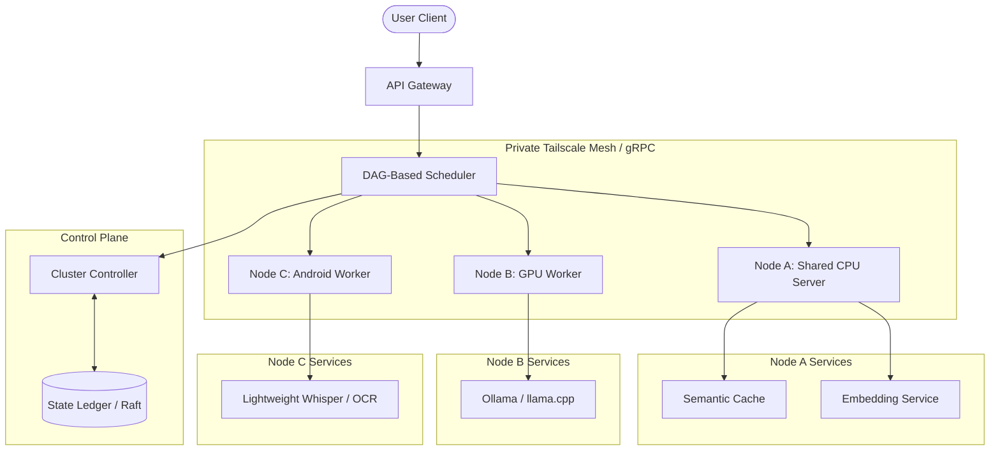
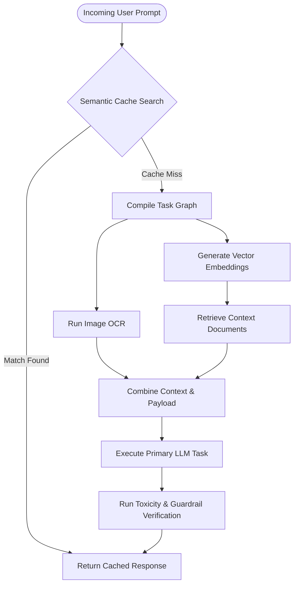

# lfhai: Local-First Heterogeneous AI Runtime

lfhai is a distributed, local-first compute fabric and runtime designed to coordinate mismatched, resource-constrained consumer hardware into a unified AI system. Rather than relying on uniform cluster topologies (like homogeneous GPU nodes), lfhai abstracts heterogeneous hardware—such as standard consumer GPUs, older CPUs, mobile devices, and shared local servers—into a single execution layer.

The runtime handles cluster orchestration, metadata consensus, dynamic Task Graph (DAG) scheduling, semantic caching, and private mesh networking.

---

## System Architecture



### Core Architecture Components

* **API Gateway:** The ingress controller for client requests. It exposes unified REST and gRPC endpoints, accepts compound execution payloads, and submits tasks to the scheduler.
* **DAG-Based Scheduler:** The execution brain. It compiles multi-step client requests into a Directed Acyclic Graph (DAG) of tasks. It maps steps to nodes based on network latency, capability match, and real-time resource utilization.
* **Cluster Controller:** The coordinator for node state, heartbeat monitoring, cryptographic identity verification, and registration. It maintains the control plane but remains out of the data path.
* **State Ledger:** A replicated, partition-tolerant key-value store (using an embedded Raft consensus algorithm) that tracks node health, resource limits, capability maps, and execution routes.
* **Node Worker:** A daemon running on each machine that interfaces with local hardware engines (Ollama, llama.cpp, Python runtimes) and streams telemetry back to the controller.

---

## Communication Protocol Matrix

To minimize latency and network overhead across local connections, communications are divided into distinct planes:

| Traffic Type | Protocol | Primary Purpose | Rationale |
| :--- | :--- | :--- | :--- |
| **Control Plane** | gRPC over Tailscale | Node Registration, Heartbeats, State Sync | Static interface contracts, bidirectional streaming, low CPU overhead. |
| **Telemetry Plane** | WebSockets | Real-time Dashboard updates | Decouples logging and metric streaming from core scheduling cycles. |
| **Data Plane (Small)** | gRPC Streams | Token streaming, text prompts, embedding vectors | Minimizes pipeline stalling between sequential LLM inference stages. |
| **Data Plane (Large)** | HTTP/2 / CAS | Model weights (`.gguf`), media files, artifacts | Content-Addressable Storage (CAS) with direct pull to avoid scheduler bottlenecks. |

---

## Network Topology

lfhai assumes a volatile local network environment (consumer Wi-Fi, powerline Ethernet, or local switches). Internal node-to-node routing is managed through a secure mesh, isolating cluster communication from external interfaces.

```
Internet
   │ (External Access)
   ▼
Cloudflare Tunnel
   │ (TLS Termination)
   ▼
[ API Gateway ]
   │
   ├─────── Private Tailscale Mesh (WireGuard) ────────┐
   │                                                   │
   ▼                                                   ▼
[ Node A: CPU Node ] <══════ gRPC (Data) ══════> [ Node B: GPU Node ]
```

* **Tailscale/WireGuard Mesh:** Every node joins a private, encrypted overlay network. Nodes are addressed by stable, private mesh IPs, bypassing NAT configuration and firewall hurdles.
* **Cloudflare Tunnel (Optional):** Used strictly for client-side ingress to the API Gateway from outside the local network. Internal node-to-node traffic never leaves the local mesh.

---

## Request Execution Flow (DAG Model)

In contrast to linear inference pipelines, lfhai schedules requests as execution graphs. The scheduler resolves dependency paths, matches stages against hardware capacities, and schedules concurrent paths.



---

## Target Hardware Profile (3-Node MVP Cluster)

The MVP targets three mismatched physical systems to validate the scheduling engine and fault tolerance model.

### 1. Controller & Storage Node (Shared CPU Server)
* **Hardware:** Intel Xeon CPU (12 Cores), 120GB RAM, 1TB NVMe SSD.
* **Primary Role:** Cluster Gateway, Cluster Controller, Raft Ledger, Semantic Cache (KV Database), RAG Vector Database.
* **Storage Path:** Houses global model repository (`/srv/models`) and semantic cache snapshots.

### 2. Primary Inference Node (GPU Workstation)
* **Hardware:** AMD Ryzen 5, 16GB RAM, NVIDIA RTX 3060 (12GB VRAM).
* **Primary Role:** Heavy LLM inference.
* **Execution Daemon:** Runs the local worker runtime wrapping Ollama/llama.cpp to serve quantized weights (e.g., Llama-3-8B-Q4_K_M).

### 3. Edge / Multimodal Node (Legacy PC or Android Phone)
* **Hardware:** Android Phone (Snapdragon 8 Gen 1, 6GB RAM, running Termux) or Legacy PC (GT 710, 8GB RAM).
* **Primary Role:** Voice transcription (Whisper-tiny), image preprocessing/OCR, local state logging.

---

## Directory Structure

```
lfhai/
├── core/
│   ├── scheduler/       # Task Graph (DAG) construction, scheduling algorithms
│   ├── controller/      # Node coordination, heartbeat checks, registration API
│   ├── registry/        # Service discovery, cryptographic credential verification
│   ├── monitoring/      # Prometheus-compatible metric endpoints & collection
│   ├── semantic-cache/  # Vector similarity cache layer
│   ├── rag/             # Local database vector indexing and chunking utilities
│   ├── kv-store/        # Lightweight Raft-backed cluster ledger
│   └── inference/       # Execution wrappers for Ollama, llama.cpp, and ONNX
├── agents/              # Local operational routines (logs analysis, diagnostic scripts)
├── worker/              # Node worker daemon code (runs on all cluster machines)
├── dashboard/           # Web UI for cluster utilization and DAG flow monitoring
├── cli/                 # `lfh` command-line utility for cluster control and monitoring
├── install/             # Cluster installation scripts (`install.sh`)
├── scripts/             # Internal helper tools and configuration generators
└── docs/                # Design specifications, API contracts, and guides
```

---

## Node Management API Specifications

### 1. Node Registration
A node registers with the Controller immediately upon daemon startup.

* **Endpoint:** `POST /api/v1/nodes/register`
* **Protocol:** gRPC or REST (HTTP/2)
* **Request Payload Schema:**
```json
{
  "node_id": "uuid-v4-string",
  "hostname": "gpu-node-01",
  "mesh_ip": "100.64.0.5",
  "resources": {
    "cores": 6,
    "memory_bytes": 17179869184,
    "gpu": {
      "model": "NVIDIA GeForce RTX 3060",
      "vram_bytes": 12884901888,
      "cuda_version": "12.2"
    },
    "storage_bytes": 500107862016
  },
  "capabilities": [
    "inference.llama3-8b",
    "embeddings.text-embedding-3-small"
  ]
}
```

### 2. Heartbeat Telemetry
The Node Worker sends heartbeats every 2.5 seconds. If 3 consecutive heartbeats are missed, the node is flagged as offline and tasks are rescheduled.

* **Endpoint:** `POST /api/v1/nodes/heartbeat`
* **Protocol:** gRPC Stream / REST
* **Telemetry Payload Schema:**
```json
{
  "node_id": "uuid-v4-string",
  "timestamp": 1719999000,
  "metrics": {
    "cpu_usage_pct": 14.5,
    "memory_used_bytes": 8589934592,
    "gpu_usage_pct": 82.0,
    "gpu_vram_used_bytes": 10737418240,
    "gpu_temp_celsius": 68.0,
    "disk_free_bytes": 240518172672
  }
}
```

---

## Phased Implementation Roadmap

### Phase 1: Steel Thread MVP (Core Connectivity)
* Build the base `install.sh` provisioning pipeline to install Docker, configure a Tailscale client interface, and bootstrap the `worker` daemon.
* Implement static registration and 2.5-second heartbeat telemetry intervals.
* Construct a naive Router that delegates LLM tasks to the GPU node and semantic check queries to the CPU node.

### Phase 2: Fault-Tolerant Topology
* Integrate the Raft consensus engine in `core/kv-store` to replicate node tables and route maps.
* Implement node-failure detection logic (heartbeat expiration).
* Introduce automated task re-queuing and failover routes for warm replica models.

### Phase 3: Graph Engine (DAG Scheduling)
* Implement the dynamic Task Graph Compiler in `core/scheduler`.
* Optimize scheduling computations to evaluate system memory constraints and network link latencies.
* Implement parallel execution paths inside the node worker (e.g., streaming audio transcription and vector RAG querying concurrently).

---

## Operational Safety

To preserve cluster stability, operations are governed by strict safety bounds:

> [!WARNING]
> Node recovery scripts execute within sandboxed namespaces with restricted shell privileges. Autonomous agents cannot modify host configuration files outside their container volume bounds.

> [!NOTE]
> System topology modifications (e.g., adding or removing a persistent Node, model-version updates) require manual administrator approval via the Command Line Interface (`lfh admin approve`) or the Cluster Dashboard.
