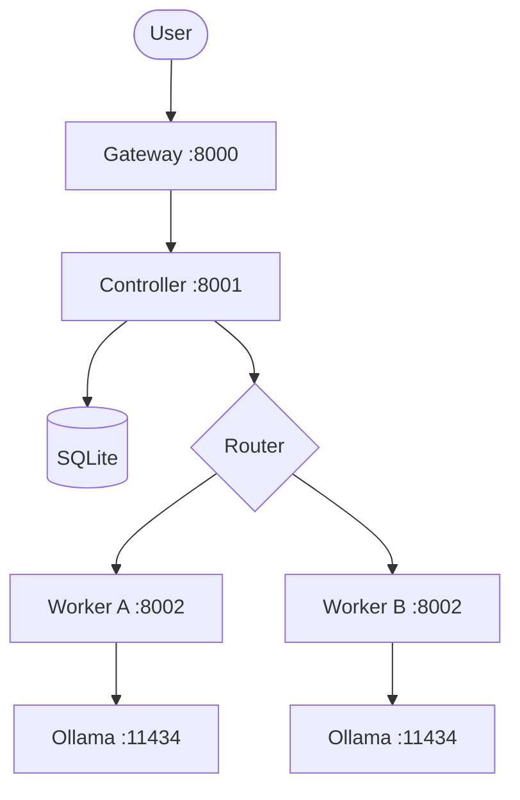

# lfhai: Local-First Heterogeneous AI Runtime

lfhai is a distributed, local-first compute fabric and runtime designed to coordinate mismatched, resource-constrained consumer hardware into a unified AI system. Rather than relying on uniform cluster topologies (like homogeneous GPU nodes), lfhai abstracts heterogeneous hardware—such as standard consumer GPUs, older CPUs, mobile devices, and shared local servers—into a single execution layer.

**Status: V1 Implemented** - Core routing, node registration, heartbeat monitoring, and CLI are working. 39 tests passing.

---

## Quick Start

```bash
# Install
git clone https://github.com/pranavkhaspa/lfhai.git
cd lfhai
pip install -e .

# Start the controller
lfh controller

# Mint a one-time join token (prints an lfh node join <token> command)
lfh token create

# On each worker machine, run the printed command to join, then:
lfh worker start

# Submit a chat request
lfh chat llama3 "What is the capital of France?"

# Check cluster status
lfh status
```

---

## What V1 Includes

| Component | Status | Description |
|-----------|--------|-------------|
| **Controller** | Working | Node registry (SQLite), heartbeat tracking, task routing |
| **Worker** | Working | Ollama integration, capability detection, task execution |
| **Gateway** | Working | OpenAI-compatible HTTP API (streaming + non-streaming) |
| **CLI** | Working | `lfh` command: status, chat, nodes, models, worker start |
| **Router** | Working | GPU-preferring, capability-aware node selection |
| **Tailcat** | Ready | Encrypted tunnel wrapper (needs tailcat binary installed) |
| **Tests** | 39 passing | Models, registry, router, controller API, join-token auth |
| **install.sh** | Ready | Worker provisioning script (Ollama + lfhai + systemd) |

### What V1 Does NOT Include (Future)

- DAG scheduling (requests go to single best node, no graph splitting)
- Raft consensus (single controller, SQLite-backed)
- Tailscale mesh (direct HTTP, tailcat available as opt-in)
- Semantic caching (exact-match routing only)
- RAG / embedding support
- Dashboard / web UI
- Android / mobile nodes
- Guardrails / content filtering

---

## Architecture (V1)

```
User (HTTP) --> Gateway (:8000) --> Controller (:8001)
                                          |
                                    SQLite Registry
                                    Task Router
                                          |
                                    Worker (:8002)
                                          |
                                    Ollama (:11434)
```



---

## CLI Reference

```
lfh status                    # Show cluster health
lfh nodes                     # List all registered nodes
lfh models                    # List available models across cluster
lfh chat <model> <prompt>     # Submit a chat request
lfh chat --stream <model> <prompt>  # Stream response
lfh worker start              # Start worker on this machine
lfh worker status             # Check local worker status
lfh controller                # Start the controller
lfh gateway                   # Start the gateway
```

---

## Cluster Authentication

lfhai uses one-time **join tokens** to admit machines; no accounts or
sign-ups required (perfect for private clusters on your own hardware).

1. On the controller machine: `lfh token create` — prints a single
   `lfh node join HOST:PORT:SECRET` command.
2. On each worker machine: run that exact command once.

What that gives you:

- **No IP hunting or port config** — the token carries the controller
  address and secret, so onboarding is one paste per machine.
- **Single-use tokens** — each token admits one machine, then dies.
- **Expiry** — tokens default to a 1-hour lifetime (`--ttl-hours` on `lfh token create`).
- **Hashed at rest** — the controller stores only SHA-256 hashes of tokens
  and node secrets, never plaintext.
- **Server-assigned identities** — the controller generates each node's ID,
  and the worker stores its credential in `~/.lfhai/credentials.json` (0600).
- **Authenticated nodes** — worker registration and heartbeats require the
  node secret; `lfh token list` / `lfh token revoke` manage tokens.

Out of scope for V1: TLS between nodes and authenticated worker endpoints
are planned for V2 networking.

---

## API Endpoints

### Gateway (port 8000)
| Method | Endpoint | Description |
|--------|----------|-------------|
| POST | `/v1/chat/completions` | OpenAI-compatible chat completions |
| GET | `/v1/models` | List available models |
| GET | `/v1/nodes` | List cluster nodes |
| GET | `/health` | Health check |

### Controller (port 8001)
| Method | Endpoint | Description |
|--------|----------|-------------|
| POST | `/api/v1/nodes/join` | Admit a node with a one-time join token |
| POST | `/api/v1/nodes/register` | Register a worker node (Bearer node secret required) |
| POST | `/api/v1/nodes/heartbeat` | Send heartbeat telemetry (Bearer node secret required) |
| GET | `/api/v1/nodes` | List all nodes |
| GET | `/api/v1/nodes/{id}` | Get node details |
| DELETE | `/api/v1/nodes/{id}` | Remove a node |
| POST | `/v1/chat/completions` | Route chat to best worker |
| GET | `/v1/models` | List all models |
| GET | `/api/v1/tasks/{id}` | Get task status |

### Worker (port 8002)
| Method | Endpoint | Description |
|--------|----------|-------------|
| GET | `/worker/status` | Worker status + capabilities |
| POST | `/worker/task` | Execute inference task |
| GET | `/health` | Health check |

---

## Development

```bash
# Install with dev dependencies
pip install -e ".[dev]"

# Run tests
python -m pytest tests/ -v

# Lint
ruff check lfhai/ tests/

# Format
ruff format lfhai/ tests/
```

---

## Project Structure

```
lfhai/
├── lfhai/
│   ├── __init__.py         # Package init
│   ├── models.py           # Shared data models (Pydantic)
│   ├── controller.py       # Cluster controller + HTTP API
│   ├── worker.py           # Worker daemon + Ollama proxy
│   ├── gateway.py          # User-facing HTTP gateway
│   ├── router.py           # Task routing logic
│   ├── ollama.py           # Ollama API client
│   ├── registry.py         # SQLite node registry + task store
│   ├── tailcat.py          # Tailcat encrypted tunnel wrapper
│   └── cli.py              # lfh CLI tool
├── tests/
│   ├── test_models.py      # Model tests (7)
│   ├── test_registry.py    # Registry tests (7)
│   ├── test_router.py      # Router tests (3)
│   └── test_controller.py  # Controller API tests (8)
├── pyproject.toml          # Project config
├── install.sh              # Worker provisioning script
└── V1_PLAN.md              # V1 implementation plan
```

---

## Hardware Requirements

### Minimum V1 Cluster (2 nodes)

**Controller Node:**
- Any machine with Python 3.10+
- 2+ CPU cores, 4GB RAM
- Runs: controller + gateway

**Worker Node:**
- Machine with Ollama installed
- GPU recommended (NVIDIA CUDA)
- Runs: worker daemon + Ollama

### Optional: Tailcat Encrypted Tunnels

If nodes are on different networks, install [tailcat](https://github.com/tailscale/tailcat) for encrypted tunnels:

```bash
# macOS
brew install tailcat

# Go
go install github.com/tailscale/tailcat/cmd/tailcat@latest
```

---

## Roadmap

### V1 (Current) - Basic Routing
- [x] Node registration + heartbeat
- [x] Capability-aware routing
- [x] Ollama integration
- [x] OpenAI-compatible API
- [x] CLI tool
- [x] Tests (25 passing)

### V2 - Networking
- [ ] Tailcat tunnel integration
- [ ] Multi-controller support
- [ ] Node-to-node direct communication

### V3 - Intelligence
- [ ] DAG scheduling (multi-step prompts)
- [ ] Semantic caching
- [ ] RAG support
- [ ] Embedding routing

### V4 - Scale
- [ ] Dashboard / web UI
- [ ] Raft consensus
- [ ] Android / mobile nodes
- [ ] Guardrails
